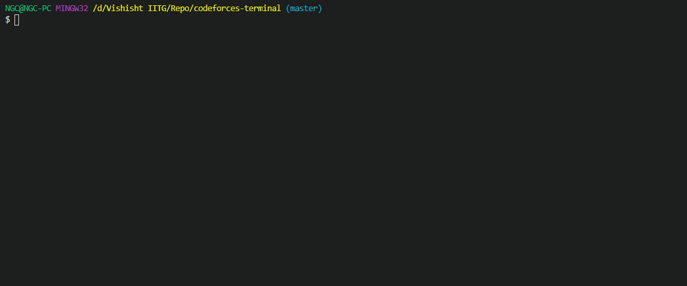
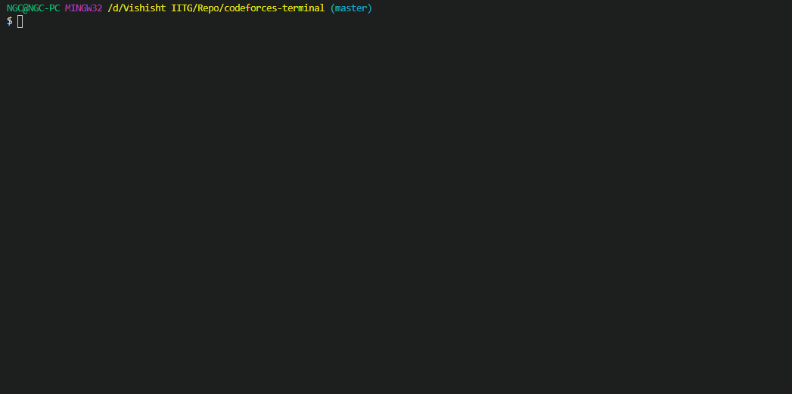
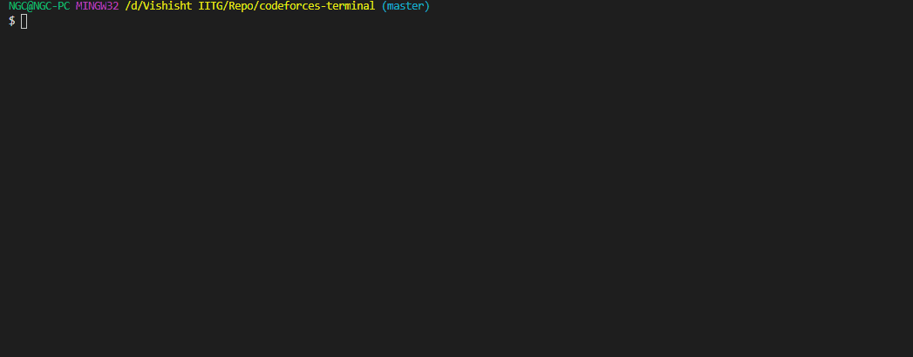
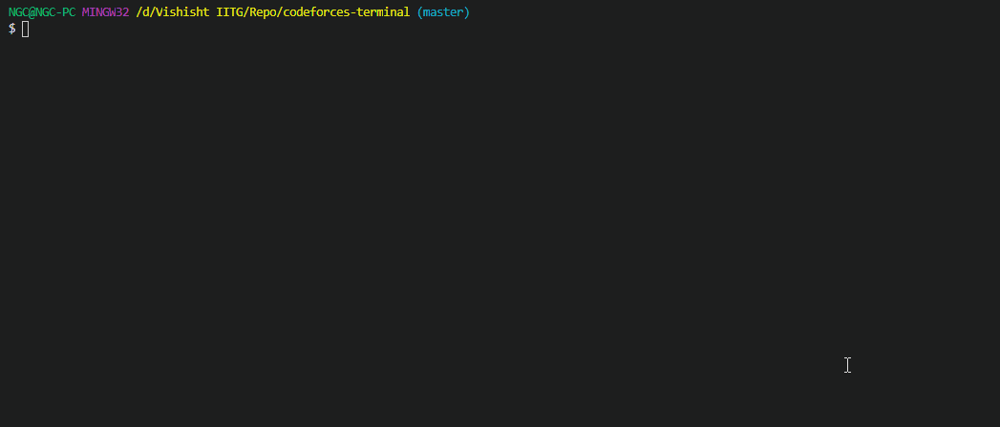
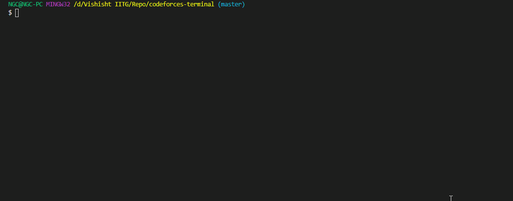
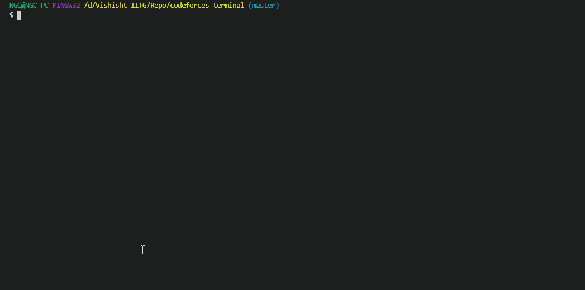
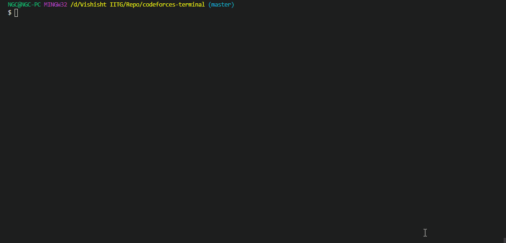
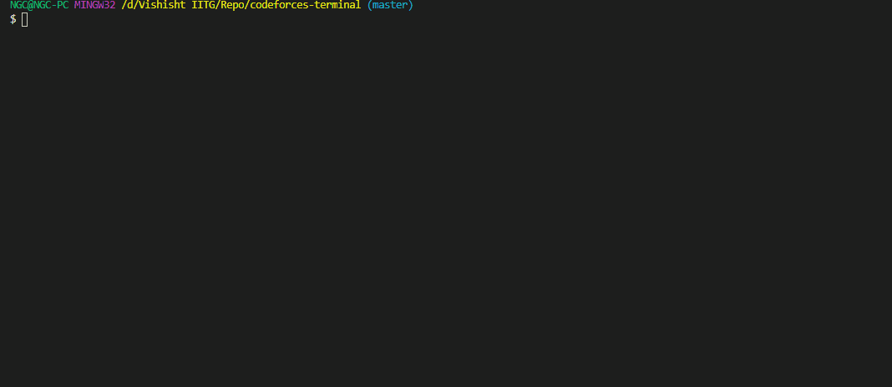

# cftool
A command line tool to bring complete functionalities of Codeforces to your terminal

## Overview
cftool(codeforces-terminal) is a NodeJS based CLI tool which allows users to completely access codeforces using your terminal. Currently it enables users to login to the website using terminal and make submissions. It also displays rating graphs of single as well as multiple users. 

Future versions will bring in the complete functionalities of the website to the terminal.
## Build Instructions
```
git clone https://github.com/vishishtpriyadarshi/codeforces-terminal.git
cd codeforces-terminal
npm init
npm install
sudo npm link
mkdir ~/.cftool
cd ~/.cftool
touch cookie.json
```

## Usage
```
          __           _                     _
   ___   / _|         | |_    ___     ___   | |
  / __| | |_   _____  | __|  / _ \   / _ \  | |
 | (__  |  _| |_____| | |_  | (_) | | (_) | | |
  \___| |_|            \__|  \___/   \___/  |_|


cftool  v1.0.1 by Vishisht Priyadarshi


Usage: cftool [options] [command]

Options:
  -V, --version   output the version number
  -h, --help      display help for command

Commands:
  cfuser          Setting up details of the user
  login           Log into the Codeforces Platform
  logout          Log out from the Codeforces Platform
  compiler        Manage compiler options
  submit          Submit solution
  rating          Show Rating Graph of the specified user
  help [command]  display help for
```



## 1. Setting up Credentials

```
Usage: cftool-cfuser [options] [command]

Options:
  -h, --help      display help for command

Commands:
  set             Adding the details of the user
  show            Show the details of the user
  remove          Remove the details of the user
  help [command]  display help for command
  
```

### a. Set handle
```
cftool cfuser set
```


### b. Check handle
```
cftool cfuser show
```


### c. Remove previously-set handle
```
cftool cfuser remove
```



## 2. Logging in
```
cftool login
```


## 3. Compiler Options

```
Usage: cftool-compiler [options] [command]

Options:
  -h, --help      display help for command

Commands:
  set             Set new compiler
  show            Show added compiler
  remove          Remove the added compiler
  help [command]  display help for command
```

### a. Select compiler 
```
cftool compiler set
cftool compiler show
```


### b. Un-select compiler 
```
cftool compiler remove
```


## 4. Submit a problem
```
cftool submit
```


## 5. Display rating graph

```
Usage: cftool-rating [options] [command]

Options:
  -h, --help         display help for command

Commands:
  solo [options]     Show rating of a single user
  compare [options]  Compare rating graph of 2 users
  help [command]     display help for command
```

### a. Single user
```
cftool rating solo --handle=<handle_name>
```



### b. Compare two users
```
cftool rating compare --handle1=<handle_name1> --handle2=<handle_name2>
```


## 6. Logging out
```
cftool logout
```


## Changelog
[ Read the changelog here 🡒](https://github.com/vishishtpriyadarshi/codeforces-terminal/blob/master/CHANGELOG.md)
## Features to be Added

- [X] Compare rating of users
- [ ] Dynamic verdict display
- [ ] Fetch problem statements with sample test cases
- [ ] Fetch users' details and blogs
- [ ] Display Contest Results
- [ ] Cross-platform support

### License
[MIT](https://choosealicense.com/licenses/mit/)

